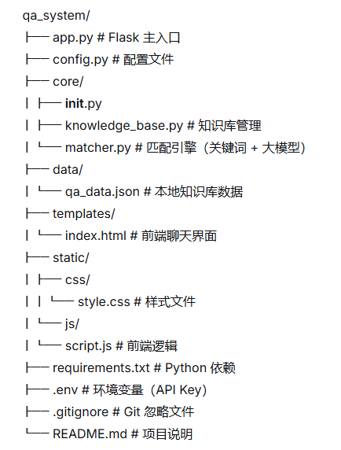

# 🤖 AI 智能问答系统

基于 **Flask** + **智谱AI (GLM-4-Flash)** 构建的智能问答系统，支持文本问答、知识库管理和多端访问。

---

## ✨ 功能特点

- 🧠 **大模型驱动**：接入智谱AI GLM-4-Flash 模型，回答准确、自然
- 📚 **知识库优先**：支持本地 JSON 知识库，命中后直接返回，减少 API 调用
- 💬 **友好界面**：简洁美观的聊天界面，支持快捷提问和键盘发送
- 📱 **多端适配**：响应式设计，电脑和手机都能流畅使用
- 🚀 **云端部署**：支持 Render 一键部署，分享链接即可访问
- 🔐 **安全存储**：API Key 通过环境变量管理，不上传代码仓库

---

## 📸 效果预览


> 在线演示：https://qa-system-zan7.onrender.com

---

## 🏗️ 项目结构




---

## 🛠️ 技术栈

| 技术 | 用途 |
|------|------|
| **Python 3.11** | 后端开发语言 |
| **Flask** | Web 框架 |
| **Gunicorn** | 生产环境 WSGI 服务器 |
| **智谱AI API** | 大模型问答能力 |
| **HTML + CSS + JavaScript** | 前端界面 |
| **Git** | 版本控制 |
| **Render** | 云端部署 |

---

## 🚀 快速开始

### 1. 克隆项目

```bash
git clone https://github.com/你的用户名/qa_system.git
cd qa_system
2. 创建虚拟环境
bash
conda create -n bert_qa python=3.11 -y
conda activate bert_qa
3. 安装依赖
bash
pip install -r requirements.txt
4. 配置 API Key
在项目根目录创建 .env 文件：

text
ZHIPUAI_API_KEY=你的API
5. 启动服务
bash
python app.py
6. 访问服务
打开浏览器访问：http://localhost:5000

📤 部署到 Render
将代码推送到 GitHub 仓库

登录 Render

点击 New+ → Web Service → 连接你的 GitHub 仓库

配置：

Build Command: pip install -r requirements.txt

Start Command: gunicorn app:app

添加环境变量：ZHIPUAI_API_KEY

点击 Deploy，等待构建完成

获取公网链接，分享给朋友！

📚 本地知识库
在 data/qa_data.json 中添加问答对：

json
[
    {
        "question": "BERT的全称是什么",
        "answer": "BERT的全称是Bidirectional Encoder Representations from Transformers"
    }
]
系统会优先匹配知识库，匹配不到再调用大模型。

📌 版本历史
版本	更新内容
V0.1	原型版，单文件实现
V0.2	重构为模块化架构
V0.3	接入智谱AI大模型
V0.4	修复手机端API地址，支持多端访问
🐛 常见问题
Q: 第一次访问很慢？
A: Render 免费服务会休眠，首次访问需要 30-60 秒冷启动，后续访问正常。

Q: 手机端显示"连接服务器失败"？
A: 检查 script.js 中的 API_URL 是否改为公网地址（https://你的服务名.onrender.com/ask）。

Q: 如何更新部署？
A: git push 后，Render 会自动检测并重新部署，或在页面点击 Manual Deploy → Deploy latest commit。

📄 许可证
MIT License

🙏 致谢
智谱AI 提供大模型 API

Render 提供免费云部署服务

如果觉得这个项目有帮助，欢迎 Star ⭐ 支持！


---